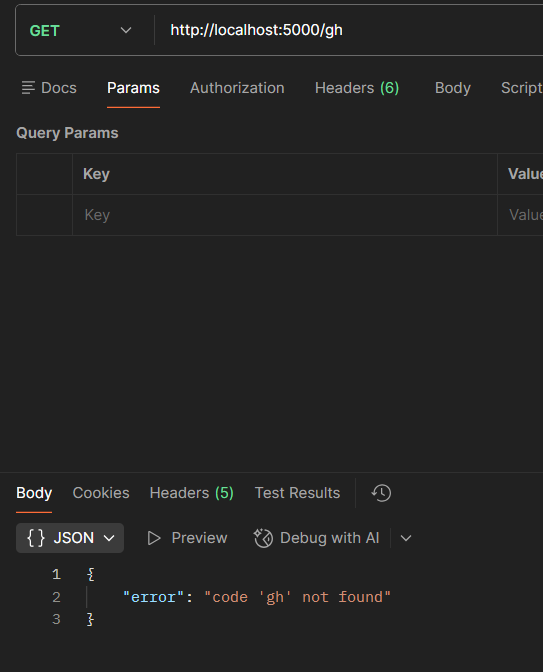
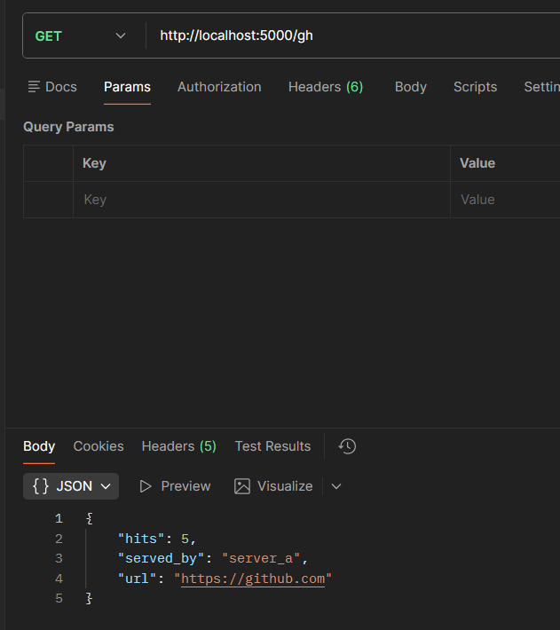
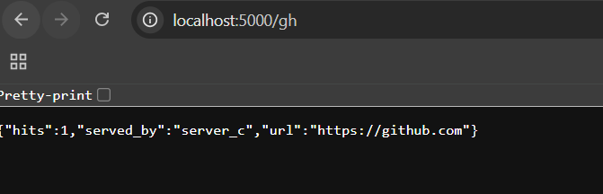
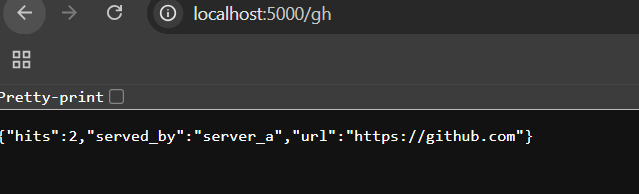
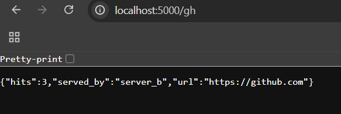
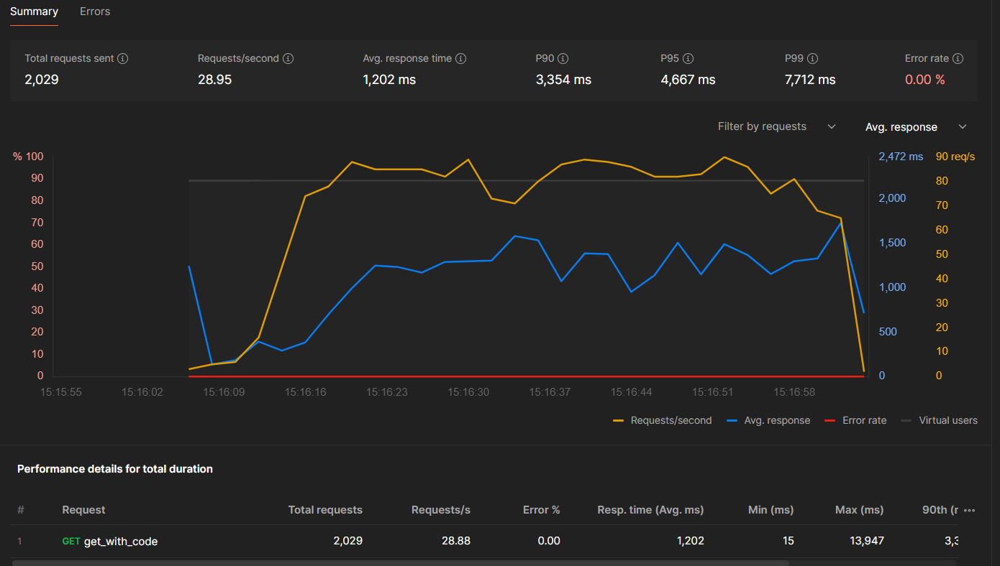

# Horizontal Scaling — LinkTracker

## What is this app?

A URL link tracker built with Flask and SQLite, scaled horizontally across
3 app servers behind an Nginx load balancer — all orchestrated with Docker Compose.

| Endpoint | Method | What it does |
|---|---|---|
| `/` | GET | Health check |
| `/who` | GET | Returns which server handled the request |
| `/shorten` | POST | Stores a short code → long URL mapping |
| `/<code>` | GET | Resolves the short code and increments hit counter |

---

## What is Horizontal Scaling?

Horizontal scaling means adding **more machines running the same application**
instead of making one machine bigger.

```
Vertical Scaling                    Horizontal Scaling
┌──────────────────────┐            ┌────────┐ ┌────────┐ ┌────────┐
│  One big machine     │            │Server A│ │Server B│ │Server C│
│  8 CPU, 64GB RAM     │            │2 CPU   │ │2 CPU   │ │2 CPU   │
│  single point        │            └────────┘ └────────┘ └────────┘
│  of failure          │               distributed, fault tolerant
└──────────────────────┘
```

Key requirement: **app servers must be stateless**. All state (data) must
live in a shared store, not inside any individual server.

---

## Architecture

```
         You / Postman
              │
     localhost:5000
              │
    ┌─────────▼─────────┐
    │    Nginx LB        │  ← round-robin across 3 servers
    │  (nginx:alpine)    │
    └──┬───────┬───────┬─┘
       │       │       │
  ┌────▼──┐ ┌──▼───┐ ┌─▼────┐
  │server │ │server│ │server│  ← same code, same image
  │  _a   │ │  _b  │ │  _c  │     different container
  └────┬──┘ └──┬───┘ └─┬────┘
       │       │        │
       └───────┼────────┘
               │
    ┌──────────▼──────────┐
    │   db_data volume     │  ← shared SQLite (Docker named volume)
    │   /data/links.db     │
    └─────────────────────┘
```

---

## Files in this folder

| File | Purpose |
|---|---|
| [app.py](app.py) | Flask application — stateless, reads config from env vars |
| [Dockerfile](Dockerfile) | Builds the app image |
| [docker-compose.yml](docker-compose.yml) | Phase 2 — shared DB setup (correct) |
| [docker-compose.stateful.yml](docker-compose.stateful.yml) | Phase 1 — isolated DBs (intentionally broken for demo) |
| [nginx.conf](nginx.conf) | Nginx round-robin load balancer config |
| [requirements.txt](requirements.txt) | Python dependencies |

---

## How to Run

```bash
# Phase 1 — Stateful (broken) — demonstrates the problem
docker compose -f docker-compose.stateful.yml up --build

# Phase 2 — Shared DB (fixed) — the correct setup
docker compose up --build

# Other useful commands
docker compose ps                  # check container status
docker compose logs -f             # watch all container logs live
docker compose logs -f server_a    # watch one server only
docker compose down                # stop all containers
docker compose down -v             # stop + delete the shared volume
```

---

## Phase 1 vs Phase 2 — The Stateful Problem

### Phase 1 — Stateful (each server has its own private database)

```bash
docker compose -f docker-compose.stateful.yml up --build
```

POST a link — it lands on server_a:
```bash
curl -X POST http://localhost:5000/shorten \
     -H "Content-Type: application/json" \
     -d "{\"code\":\"gh\",\"url\":\"https://github.com\"}"
# {"served_by": "server_a", "short": "http://localhost/gh"}
```

GET it 6 times — only 1 in 3 succeeds:
```
{"url": "https://github.com", "served_by": "server_a"}   ✓
{"error": "code 'gh' not found"}                          ✗  server_b has empty DB
{"error": "code 'gh' not found"}                          ✗  server_c has empty DB
{"url": "https://github.com", "served_by": "server_a"}   ✓
{"error": "code 'gh' not found"}                          ✗
{"error": "code 'gh' not found"}                          ✗
```

**Postman performance results — stateful setup:**

Without seeded data (first run, all servers empty):



With data seeded on one server (2 out of 3 servers return 404):



---

### Phase 2 — Shared DB (all servers mount the same Docker volume)

```bash
docker compose up --build
```

POST once, GET from any server — always succeeds:
```
{"url": "https://github.com", "served_by": "server_a"}   ✓
{"url": "https://github.com", "served_by": "server_b"}   ✓
{"url": "https://github.com", "served_by": "server_c"}   ✓
```

**Postman performance results — shared DB (stateless) setup:**







---

## Final Performance Result — Horizontal Scaling vs Single Server - bottle neck - db locks file writes - result in slower response - decreases throughput - can be increased with postgres db offers row level locks.



---

## Doubts Raised and Answered During This Lab

---

### Q1 — Why does Nginx show `502 Bad Gateway`?

Flask by default binds to `127.0.0.1` (loopback — only accepts connections
from inside the same container). Nginx runs in a **different container** and
connects over the Docker network — which is not `127.0.0.1`.

```
BROKEN:  app.run(port=5000)
         → binds to 127.0.0.1 → Nginx can't reach it → 502

FIXED:   app.run(host="0.0.0.0", port=5000)
         → binds to all interfaces → Nginx can reach it → 200
```

**Rule:** Always use `host="0.0.0.0"` when running inside Docker.

---

### Q2 — Why can't I click `http://0.0.0.0:5000` in the browser?

`0.0.0.0` is a **binding instruction** to the server, not a real address.
It means "listen on all network interfaces". It is not a destination you
can navigate to.

```
0.0.0.0:5000   = server's instruction: "accept from anywhere"
localhost:5000  = your browser's destination: "connect to this machine"
```

Always visit `http://localhost:5000` in your browser or Postman.

---

### Q3 — Why does `docker-compose.stateful.yml` throw `unable to open database file`?

`DB_PATH=/data/links.db` requires the `/data` directory to exist inside
the container. In the shared setup, Docker creates `/data` automatically
when it mounts the named volume. Without a volume mount, `/data` never
gets created.

```
With volume:    Docker mounts db_data → creates /data → SQLite writes there ✓
Without volume: /data does not exist → SQLite cannot create file → crash ✗
```

**Fix:** Use `DB_PATH=/app/links.db` in the stateful config — `/app`
already exists because the Dockerfile sets it as `WORKDIR`.

---

### Q4 — How does Docker create a container? What is inside it?

```
Step 1 — Build image from Dockerfile (frozen snapshot):
  FROM python:3.11-slim  → base Linux filesystem
  WORKDIR /app           → creates /app directory
  COPY requirements.txt  → adds /app/requirements.txt
  RUN pip install        → installs flask into image
  COPY app.py            → adds /app/app.py
  CMD ["python","app.py"]→ startup instruction stored

Step 2 — Create container (adds a private writable layer on top):
  Image (read-only, shared)  ← same for server_a, b, c
  + Writable layer (private) ← unique to each container

Step 3 — Start container, inject env vars, run CMD:
  init_db() → sqlite3.connect(DB_PATH) → creates links.db at runtime
  app.run()  → Flask starts accepting requests
```

The DB file is created **at runtime**, not at build time.

---

### Q5 — How do volumes make the DB shared?

```
Without volume:                         With named volume:
  server_a writable layer               server_a → db_data:/data ─┐
  └── /app/links.db (A's private)                                  ├── same file
  server_b writable layer               server_b → db_data:/data ─┤
  └── /app/links.db (B's private)                                  │
  server_c writable layer               server_c → db_data:/data ─┘
  └── /app/links.db (C's private)
                                        Docker volume on host disk:
  3 separate files                       └── /data/links.db (one file)
```

The named volume **bypasses each container's private filesystem** and
points all three servers at the same physical file on disk.

---

### Q6 — Why do 500 errors appear at 100 concurrent users?

SQLite uses a **file-level write lock** — only one writer at a time.
With 100 users all hitting `GET /<code>` (which writes a hit counter
update), writers queue up. The default timeout is 5 seconds. If a writer
waits more than 5 seconds, SQLite raises `OperationalError: database is locked`
→ Flask returns 500.

```
Fix:  sqlite3.connect(DB_PATH, timeout=30)
      Writers wait up to 30 seconds instead of 5.
```

This is a bandage. The real fix is replacing SQLite with PostgreSQL,
which supports true concurrent writes via row-level locking. This is
addressed in the next lab — **Database Replication**.

---

## Key Takeaways

| Concept | What we learned |
|---|---|
| Stateless servers | App servers must not store data locally |
| Shared state | All servers connect to the same database |
| Docker networking | Containers talk by service name, not IP |
| `0.0.0.0` vs `127.0.0.1` | Always bind to `0.0.0.0` inside Docker |
| Named volumes | Punch through container isolation to share files |
| SQLite limitation | File lock = 1 writer at a time = bottleneck under load |
| Fault tolerance | Kill one server → Nginx routes around it, zero downtime |
