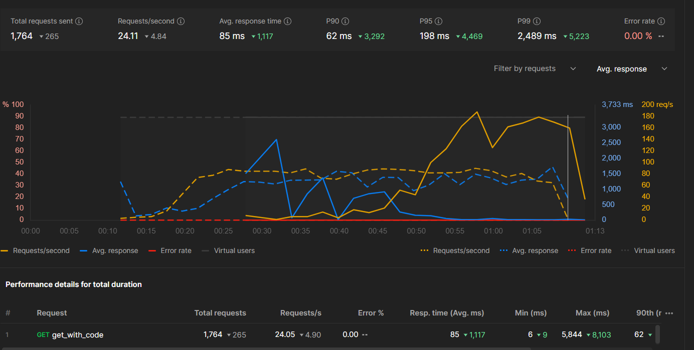

# Lab 3 — Caching: The Art of Remembering Expensive Work

## Why Scaling Alone Wasn't Enough

In Labs 1 and 2, we observed only slight improvements in throughput despite adding more workers and servers.

```
Lab 1 — Vertical Scaling:    4 workers instead of 1
  Result: slight improvement
  Why limited: SQLite file lock serialized all writes
               more workers = more threads waiting for the same lock

Lab 2 — Horizontal Scaling:  3 servers instead of 1
  Result: slight improvement
  Why limited: every single request still hit the database
               3 servers × 100 users = 100 DB queries/second
               the database became the bottleneck, not the servers
```

**The hard truth:** We scaled the app layer. We never scaled the most expensive
part — the database read.

> Scaling servers makes you faster at *asking* the database.
> Caching makes you faster by *not asking* the database at all.

---

## When Do You Actually Need Caching?

Not every system needs caching on day one. These are the real symptoms.

### Symptom 1 — Your database CPU is high but app servers are idle

```
App servers:   20% CPU  ← they're fine, waiting on DB
Database:      95% CPU  ← this is your bottleneck
```

Adding more app servers here does nothing. They're all waiting on the same
overloaded DB. Caching removes the DB from the hot path entirely.

### Symptom 2 — The same data is fetched thousands of times per second

A product page on Amazon. The title, price, and description of an iPhone don't
change every millisecond. But if 50,000 people/second view that page, you're
running 50,000 identical `SELECT * FROM products WHERE id=123` queries.
The answer is the same every time — remember it.

### Symptom 3 — Read/Write ratio is heavily skewed toward reads

```
LinkTracker:  1 POST (write) per code
              thousands of GETs (reads) for the same code
              Read:Write ratio = 1000:1

Twitter:      1 tweet written
              millions of reads of that tweet
              Read:Write ratio = 1,000,000:1
```

When the ratio is this skewed, it is almost always cheaper to cache the read
result than to recompute it from the DB every time.

### Symptom 4 — Computation is expensive, result reused frequently

A bank runs a credit score calculation — 800ms, queries 12 tables, joins loan
history, payment records, fraud flags. But a credit score doesn't change every
second. Cache it for 24 hours — 99.9% of checks return instantly from cache.

---

## Real-World Story — Instagram's Feed Problem

In 2012, Instagram had ~30 million users. Every feed refresh ran:

```sql
SELECT photos.* FROM photos
JOIN follows ON follows.followed_id = photos.user_id
WHERE follows.follower_id = 123
ORDER BY photos.created_at DESC
LIMIT 20
```

This joined two massive tables, sorted millions of rows, for every single
feed refresh. At 10 million daily active users, this query took 2-3 seconds
and the database melted.

**The fix:** Pre-compute and cache each user's feed in Redis. When someone
posts a photo, push it to the feed cache of all their followers. When you
open the app, read your pre-built feed from Redis in ~2ms.

```
Before cache:  open app → SQL JOIN → 3000ms
After cache:   open app → Redis GET → 2ms
```

**1500x faster. Same database. Same app servers. Just caching.**

---

## The Four Layers of Caching

Real systems cache at multiple levels simultaneously.

### Layer 1 — Database Query Cache

The database caches recent query results in its own memory buffer pool.

```
App → DB → DB checks its buffer pool
           → HIT: returns from RAM  (fast)
           → MISS: reads from disk  (slow) → stores in buffer pool
```

**You get this for free** with a well-tuned database. Breaks down in
distributed systems where many nodes send varied queries and thrash the buffer.

---

### Layer 2 — Application-Level Cache (Redis / Memcached)

A dedicated in-memory store between your app and your database.

```
App → Redis → HIT: return from Redis  (~0.5ms)
            → MISS: query DB (~50ms) → store in Redis → return
```

**Redis** stores key-value pairs in RAM. Supports strings, hashes, lists,
sets, sorted sets. Persistent, supports pub/sub, has built-in TTL expiry.

**Memcached** is simpler — pure key-value, no persistence, no complex data
structures. Faster for simple cases.

**Who uses it:** Twitter caches timelines. Uber caches driver locations.
Airbnb caches search results. LinkedIn caches profile data.

---

### Layer 3 — CDN Cache (Content Delivery Network)

A geographically distributed network that caches content close to the user.

```
User in Bangkok → CDN edge node in Singapore (50ms away)
                → HIT: serve from edge     (50ms total)
                → MISS: fetch from US origin (300ms) → cache at edge → serve
```

**What gets cached:** images, videos, CSS, JS, HTML pages, public API responses.

**Real-world:** Netflix stores movie files on CDN nodes worldwide. When you
press Play, video comes from a server 20ms away, not Netflix's data center
in Virginia. Without CDN, Netflix's origin servers would need to handle the
entire world's streaming bandwidth simultaneously — impossible.

**Not suitable for:** user-specific data, authenticated responses, real-time data.

---

### Layer 4 — Distributed Cache Cluster

When a single Redis node becomes a bottleneck, shard it across multiple nodes
using consistent hashing.

```
Redis Cluster — 6 nodes:
  key "user:123" → hash → Node 2
  key "user:456" → hash → Node 4
  key "user:789" → hash → Node 1
```

Each node holds a subset of data. Reads and writes are distributed.
A single Redis cluster handles millions of operations per second.

**Real-world:** Discord uses Redis Cluster to cache message history for millions
of concurrent users.

---

## The Three Caching Strategies

### Strategy 1 — Cache-Aside (Lazy Loading)

The application manages the cache manually. Cache only contains what was
actually requested.

```python
def get_link(code):
    # 1. Check cache first
    result = redis.get(f"link:{code}")
    if result:
        return json.loads(result)           # HIT — return immediately

    # 2. Cache miss — go to DB
    row = db.query("SELECT * FROM links WHERE short_code=?", code)

    # 3. Populate cache for next time
    redis.setex(f"link:{code}", ttl=300, value=json.dumps(row))
    return row
```

| | Detail |
|---|---|
| **Best for** | Read-heavy workloads, unequal data access patterns |
| **Benefit** | Cache contains only hot data, saves memory |
| **Risk** | First request after miss is always slow. Redis crash sends all traffic to DB simultaneously (stampede) |
| **Real-world** | LinkTracker — 1000 codes exist but 20 get 99% of traffic |

---

### Strategy 2 — Write-Through

Every write goes to cache AND database simultaneously. Cache is always warm.

```python
def shorten(code, url):
    db.execute("INSERT INTO links VALUES (?, ?)", code, url)  # write to DB
    redis.setex(f"link:{code}", ttl=300, value=json.dumps({"url": url, "hits": 0}))
```

| | Detail |
|---|---|
| **Best for** | Read-after-write consistency is critical |
| **Benefit** | No cold cache — every written item is immediately cached |
| **Risk** | Cache fills with data that may never be read. Slightly slower writes (two writes instead of one) |
| **Real-world** | Banking dashboard — when a transaction posts, balance is updated in both DB and cache |

---

### Strategy 3 — Write-Behind (Write-Back)

Write to cache first, return success immediately. Persist to DB asynchronously.

```
User writes → Cache (instant response)
                └── background worker → DB (async, ~seconds later)
```

| | Detail |
|---|---|
| **Best for** | Write-heavy workloads where DB write latency is unacceptable |
| **Benefit** | Fastest write response time. Allows batching writes to DB |
| **Risk** | If cache node dies before flushing — **data is lost** |
| **Real-world** | Live game leaderboard — thousands of score updates/second. Write to Redis instantly, flush to DB every 10 seconds in batch |

---

## The Problems Caching Introduces

### Problem 1 — Cache Invalidation

> *"There are only two hard things in computer science: cache invalidation and naming things."*
> — Phil Karlton

When data changes in the DB, how do you update or remove the cached version?

```
User updates profile picture
DB updated: profile_picture = "new.jpg"
Cache still has: profile_picture = "old.jpg"

For the next 5 minutes (TTL): everyone sees the old picture
```

**Solutions:**

```
TTL (Time-to-Live)       Let cache expire naturally
                         Pros: simple   Cons: stale data until expiry

Active invalidation      On write, delete the cache key
                         redis.delete(f"user:{user_id}")
                         Pros: immediate   Cons: race conditions possible

Cache versioning         Include version in key
                         redis.get(f"user:{user_id}:v{version}")
                         Pros: no invalidation needed   Cons: cache bloat
```

**Real-world:** Twitter's "edit tweet" feature. A tweet cached in 10 million
timelines requires 10 million cache invalidations on edit — a massive
engineering challenge.

---

### Problem 2 — Stale Data

Cached data that no longer reflects reality.

```
Time 0:   Product stock = 5 units → cached for 60 seconds
Time 5s:  5 customers buy the last 5 units → DB updated to 0
Time 30s: New customer checks availability
          → cache returns "5 units in stock"  ← WRONG
          → Customer places order
          → Checkout fails: "out of stock"
          → Bad experience, support ticket
```

**Real-world:** Black Friday at an e-commerce company. A 60-second TTL caused
40,000 "in-stock" orders for items already sold out. Fix: reduce TTL to
5 seconds for inventory, keep 60s for product descriptions.

**TTL should match how often data changes and how costly staleness is:**

```
Product description:  TTL = 1 hour      (rarely changes, staleness fine)
Inventory count:      TTL = 5 seconds   (changes fast, staleness costly)
Bank balance:         TTL = 0           (never cache — always read from DB)
User session token:   TTL = 30 minutes  (matches session expiry)
```

---

### Problem 3 — Cache Stampede (Thundering Herd)

When a popular cache key expires and thousands of requests simultaneously
hit the DB to rebuild it.

```
Time 0:   Cache key "homepage_top10" expires
Time 0ms: 5000 concurrent users request homepage
          → all 5000 get cache MISS simultaneously
          → all 5000 fire the same DB query
          → DB receives 5000 identical queries at once
          → DB collapses → 503 errors → site down
```

**Real-world:** Reddit 2012. Front page cache key expired during peak hours.
3 million concurrent users triggered the same DB query simultaneously.
Site went down for 20 minutes.

**Solutions:**

```python
# Solution 1 — Mutex lock (only one request rebuilds cache)
with redis_lock.Lock(redis, "homepage_rebuild"):
    result = redis.get("homepage")
    if not result:
        result = expensive_db_query()
        redis.setex("homepage", 60, result)
return result

# Solution 2 — Background pre-warming
# A cron job refreshes the cache before TTL expires
# so the key never actually expires under live traffic

# Solution 3 — Probabilistic early expiry
# Randomly start refreshing slightly before actual expiry
# distributes the rebuild across time
```

---

### Problem 4 — Memory Pressure

Redis runs in RAM. RAM is expensive and finite.

```
Cache everything → Redis fills up → Redis evicts old keys
→ evicted key requested → cache MISS → DB query
→ result cached → evicts something else
→ thrashing: constant eviction and re-caching, no real benefit
```

**Real-world:** A startup cached every API response with no TTL. Six months
later Redis had 40GB of data for endpoints not called in 5 months.
Hot data was being evicted to make room for cold data nobody needed.

**Redis eviction policies:**

```
allkeys-lru:    evict least recently used  (best for general use)
volatile-lru:   evict LRU only from keys with TTL set
allkeys-lfu:    evict least frequently used (best for skewed access patterns)
noeviction:     reject new writes when full (safest, but causes write errors)
```

---

## Dos and Don'ts in Production

### Do

```
✓ Cache read-heavy, rarely-changing data first
✓ Set TTLs on everything — never cache without expiry
✓ Monitor cache hit rate — below 80% means your strategy is wrong
✓ Degrade gracefully — if Redis is down, fall back to DB without crashing
✓ Use namespaced keys: "user:123:profile" not just "123"
✓ Cache at the right layer — static files on CDN, DB results in Redis
✓ Measure before caching — profile which queries are actually slow
```

### Don't

```
✗ Cache user-specific sensitive data without access controls
✗ Cache financial data (balances, transactions) — always read from DB
✗ Cache without understanding what invalidates it
✗ Set TTL = forever on data that can change
✗ Cache everything blindly — only cache what's read repeatedly
✗ Use cache as a primary database — it's a cache, not permanent storage
✗ Ignore cache hit rate metrics — a cold cache is worse than no cache
```

---

## How Caching Changes the LinkTracker

**Without cache — every request hits the DB:**

```
Request → Flask → SQLite → disk read → return   (~50ms per request)
100 concurrent users = 100 DB queries/second
SQLite write lock causes 500 errors at peak load
```

**With cache-aside — DB hit only on first request per code:**

```
Request 1:   Flask → Redis MISS → SQLite → Redis SET → return  (~50ms)
Request 2:   Flask → Redis HIT → return                        (~1ms)
Request 3-∞: Flask → Redis HIT → return                        (~1ms)
```

**50x faster from request 2 onwards.** DB query count drops from
40,000/minute to ~1/minute per unique code. The SQLite lock contention
that caused 500 errors at 100 concurrent users essentially disappears —
because 99% of requests never touch the DB.

---

## The Caching Decision Framework

```
Is the data read frequently with the same result?   → Cache it
Does the data change rarely?                        → High TTL (hours)
Does the data change often but read even more?      → Low TTL (seconds)
Is the data user-specific and sensitive?            → Cache with user-scoped keys
Is the data financial or transactional?             → Do NOT cache
Is the data static (images, CSS, JS)?              → CDN cache
Is the data a complex DB computation?               → Application cache (Redis)
Is read/write ratio > 10:1?                        → You almost certainly need a cache
```

---

## How The Code Works — High-Level Overview

The implementation lives in two files: [app.py](./app.py) handles HTTP routes,
[caching.py](./caching.py) owns everything Redis.

---

### app.py — Route Layer

Three routes, three caching touch-points:

```
POST /shorten
  1. Write new code + URL to SQLite           ← source of truth
  2. Call invalidate_link(code)               ← clear any negative cache
     (someone may have probed this code before it was created)
  Note: does NOT pre-populate URL cache — let cache-aside do it lazily

GET /<code>                                   ← the hot path
  1. get_cached_link(code)
       → "__NOT_FOUND__" sentinel?  → return 404 immediately  (negative HIT)
       → JSON data?                 → return URL immediately  (cache HIT)
       → None?                      → continue to DB          (cache MISS)
  2. [MISS only] SELECT from SQLite → set_cached_link(code, data)
  3. increment_hit_counter(code)    → write-behind, no DB touch
  4. Return JSON with cache: "HIT" or "MISS" visible in response

GET /cache/stats
  Returns: hits, misses, hit_rate_pct, redis_memory, evictions,
           cached_keys (link:* count), pending_hits (hits:* count)
```

---

### caching.py — Redis Layer

Two strategies running simultaneously:

**Strategy A — Cache-Aside (URL resolution)**

```
Redis key pattern:  link:{code}
Value on HIT:       JSON string  → {"url": "https://..."}
Value on NEG HIT:   "__NOT_FOUND__" sentinel string
TTL on URL:         3600s (1 hour)  — URLs never change after creation
TTL on miss:        30s             — short, to allow legit creates to work

get_cached_link(code)   → check Redis, update _stats counters, return or None
set_cached_link(code)   → r.setex(link:{code}, 3600, json.dumps(data))
set_negative_cache()    → r.setex(link:{code}, 30, "__NOT_FOUND__")
invalidate_link()       → r.delete(link:{code})
```

**Strategy B — Write-Behind (hit counter)**

```
Redis key pattern:  hits:{code}
increment_hit_counter() → r.incr(hits:{code})   ← atomic, returns new count
                         → NO database write at all

Background flusher (runs every 30 seconds):
  1. r.keys("hits:*")                → find all pending counters
  2. r.getdel(key)                   → atomic GET + DELETE (no double-count)
  3. UPDATE links SET hits = hits+N  → batch write to SQLite
```

**Why GETDEL is critical:** If you did `GET` then `DEL` as two separate calls,
a new hit could arrive between them and be silently deleted. `GETDEL` makes
this a single atomic operation — zero risk of losing a hit.

---

### Data Flow at a Glance

```
Cold start (first GET /abc):
  Request → Flask → Redis MISS → SQLite SELECT → Redis SET → Response
                                                              cache: "MISS"

Warm (every subsequent GET /abc):
  Request → Flask → Redis HIT → Response      (SQLite never touched)
                                               cache: "HIT"

Hit counting (every GET /abc):
  Request → r.incr(hits:abc) → returns instantly
  [30s later] flusher → r.getdel(hits:abc) → SQLite UPDATE

Non-existent code (GET /xyz, first time):
  Request → Redis MISS → SQLite SELECT (row is None) → r.setex(link:xyz, 30, "__NOT_FOUND__")
  [Next 30 requests for /xyz] → Redis HIT → 404 immediately, DB never queried
```

---

### In-Process Stats vs Redis Stats

`_stats = {"hits": 0, "misses": 0}` lives in each server's Python process.
With 3 servers behind Nginx, each server counts only its own share of traffic.
`/cache/stats` reports per-server counts, not cluster-wide totals.

Redis memory and eviction stats (`r.info()`) are cluster-wide — they come
from the single shared Redis container.

---

## Performance Result — Caching vs No Caching

Tested in Postman Performance tab — 100 virtual users over 1 minute,
repeatedly hitting the same short codes after a cold-start warm-up.



```
Without cache (Lab 2):  every GET → SQLite SELECT → disk read
                        100 concurrent users = 100 DB queries/second
                        SQLite file lock → errors at peak load

With cache (Lab 3):     GET 1 per code → SQLite SELECT + Redis SET
                        GET 2–∞ per code → Redis GET only (~0.5ms)
                        DB query count drops to near-zero under load
                        Hit rate target: > 90%
```

**The key insight:** Adding 3 more servers (Lab 2) made us faster at
*asking* the database. Adding Redis (Lab 3) made us faster by *not asking*
the database at all.
