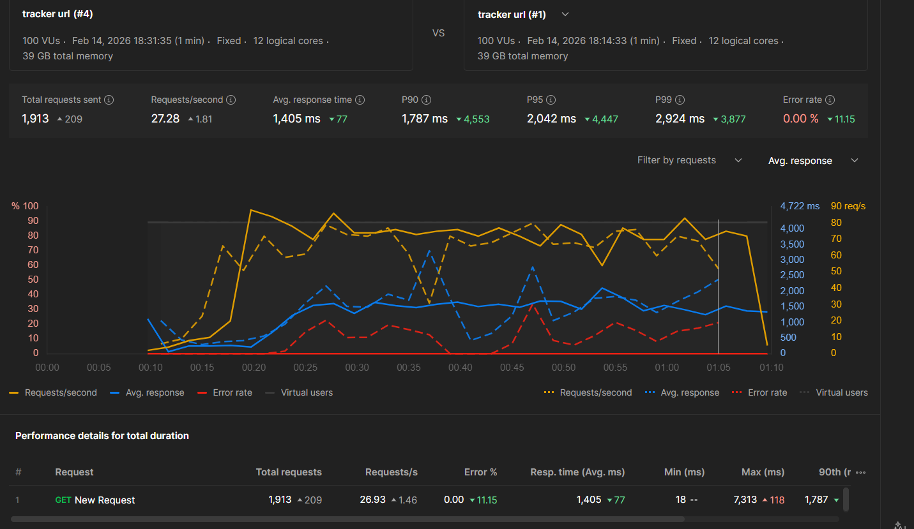

# Vertical Scaling — LinkTracker

## What is this app?

A minimal **URL link tracker** built with Flask and SQLite.

It does three things:

| Endpoint | Method | What it does |
|---|---|---|
| `/` | GET | Health check — confirms the server is running |
| `/shorten` | POST | Stores a short code mapped to a long URL |
| `/<code>` | GET | Looks up the URL by code and increments the hit counter |

All data is stored in a local `links.db` SQLite file. The app reads
`PORT` and `DB_PATH` from environment variables so the same code can
run in any environment without changes.

---

## What is Vertical Scaling?

Vertical scaling means giving **the same single machine more processing power** —
more CPU cores, more RAM, faster disk — so it can handle more concurrent requests.

```
BEFORE vertical scaling          AFTER vertical scaling
┌─────────────────────┐          ┌─────────────────────┐
│  1 CPU core         │          │  8 CPU cores        │
│  1 worker process   │          │  8 worker processes │
│  handles 1 request  │          │  handle 8 requests  │
│  at a time          │          │  simultaneously     │
└─────────────────────┘          └─────────────────────┘
   ~40 req/s                         ~300+ req/s
```

The machine stays the same. The code stays the same.
You just unlock more of what the machine already has.

---

## How Waitress Implements Vertical Scaling

Flask's built-in development server (`app.run()`) is **single-threaded** —
it processes one request at a time, queuing everything else.

[Waitress](https://docs.pylonsproject.org/projects/waitress/) is a
production-grade WSGI server that spawns **multiple threads**, allowing
the app to process many requests concurrently on the same machine.

```
Flask dev server (1 thread)      Waitress (multi-threaded)
┌──────────────────────────┐     ┌──────────────────────────┐
│ Request 1 → processing   │     │ Thread 1 → Request 1     │
│ Request 2 → waiting...   │     │ Thread 2 → Request 2     │
│ Request 3 → waiting...   │     │ Thread 3 → Request 3     │
│ Request 4 → waiting...   │     │ Thread 4 → Request 4     │
└──────────────────────────┘     └──────────────────────────┘
  bottleneck under load             handles all at once
```

### Run with Waitress

Install:
```bash
pip install waitress
```

Run with more threads (vertical scale up):
```bash
# 4 threads — matches a 4-core machine
waitress-serve --port=5000 --threads=4 app:app

# 8 threads — matches an 8-core machine
waitress-serve --port=5000 --threads=8 app:app
```

The `--threads` value is your vertical scaling lever.
Set it to match the number of CPU cores on your machine.

### Test endpoints

```bash
# Health check
curl http://localhost:5000/

# Add a short link
curl -X POST http://localhost:5000/shorten \
     -H "Content-Type: application/json" \
     -d "{\"code\":\"gh\",\"url\":\"https://github.com\"}"

# Resolve a short link
curl http://localhost:5000/gh
```

---

## Key Limitation

Vertical scaling has a hard ceiling — you cannot add infinite CPUs to
one machine. It is also a **single point of failure**: if this one
machine goes down, the entire service is unavailable.

This is why vertical scaling is always the **first step**, not the final
solution. Once you hit the machine's limit, you move to **horizontal
scaling** (multiple machines behind a load balancer).

---

## Performance Test Result

Tested in Postman Performance tab — 100 virtual users over 1 minute,
comparing Flask dev server vs Waitress with 8 threads on the same machine.
Through-put (requests processed / second) has been increased slightly, 4 cores perfomance are better than single core


